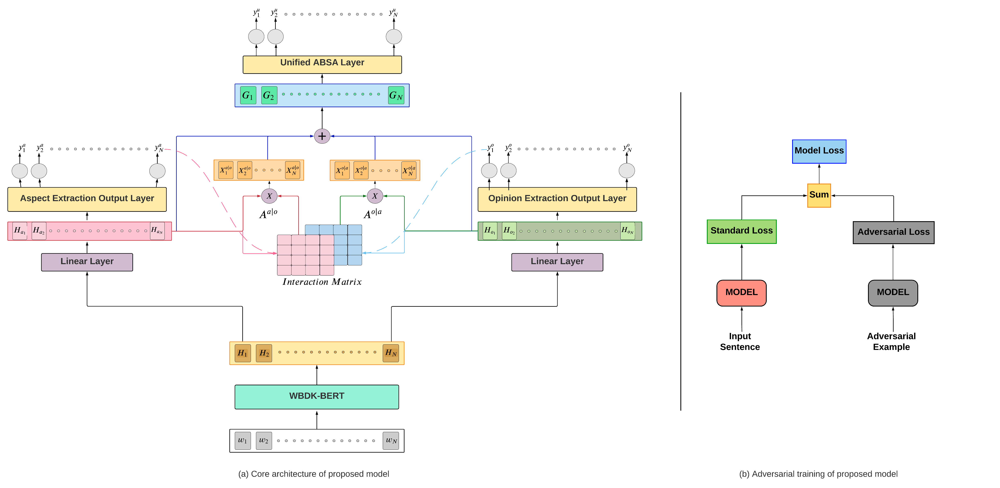

# BILEAT_E2E_ABSA

BERT-based Interactive Learning with Ensemble Adversarial Training



## Requirements
- Install requirements using `requirements.txt`
```
pip install -r requirements.txt
```
- To filter out antonyms we use word embeddings used by [Jin, Di, et al.](https://arxiv.org/abs/1907.11932). You can download that from [here](https://drive.google.com/file/d/1bayGomljWb6HeYDMTDKXrh0HackKtSlx/view). Place it in the root directory before running code for generating adversarial examples.

## Getting Started
### White Box Domain Knowledge BERT (WBDK-BERT)
For white-box adversarial post training of DK-BERT, we use the Amazon Laptop review and Yelp restaurant review datasets from [here](https://github.com/ruidan/IMN-E2E-ABSA). Any other dataset can be used as well just by replacing the `laptop.txt` and `rest.txt` file contents.
To start the training, inside the `WBDK-BERT/scripts` directory run:
```bash
$ bash pt.sh laptop 5 2000 0
```
```bash
$ bash pt.sh rest 1 2000 0
```
here, 5 and 1 are the data duplication factors, 2000 is the number of training steps (*we actually save models at every 500 steps*).

Now, the trained models will be save in `WBDK-BERT/{domain}_pt_adv` directory which will be then loaded later for use by BILEAT.

*Optional*
You can either start training from scratch by loading BERT-base and performing adversarial post-training on top of that (which is computationally expensive) or by loading post-trained domain knowledge BERT (DK-BERT) and continue adversarial post-training for reduced number of iterations.
For training from scratch using BERT-base, set `BERT` attribute in `WBDK-BERT/scripts/pt.sh` to `bert-base`. Use `70000` and `140000` iterations respectively.

### Generating Black-box adversarial examples

1.  Replace `BILEAT` with `BERTLINEAR` in `absa_layer.py` line `133`.

2. Run `gen_adv.sh`. This first trains `BERT + Linear` model to get the target model, then performs black-box attack to generate adversarial examples.

The output is stored in `{domain}_adv` directory.

### Running BILEAT
After completing the above two steps, run:
```bash
$ bash train.sh
```
This will first load the post-trained `WBDK-BERT` model from `{domain}_adv` and train the model using `BILEAT` architecture along with adversarial data generated earlier using `BERT + Linear`.

### Adversarial Data
We provide quality adversarial examples generated by us for SemEval14 laptop and SemEval combined restaurant data. You can find them under `data/laptop14_adv` and `data/rest_total_adv` respectively.


